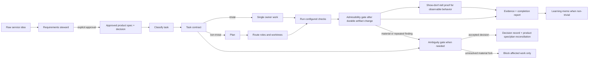

# Harness architecture

This template turns a project repository into a self-describing Codex harness.
It is deliberately framework-agnostic: adapters define project commands while
the harness defines how work is planned, delegated, verified, and explained.

## Layers and sources of truth

| Layer | Purpose | Source of truth |
| --- | --- | --- |
| Entry point | Fast agent orientation and hard data boundary | `AGENTS.md` |
| Policy | Routing, thresholds, dependency pin, validations, authority | `harness.config.json` |
| Durable record | Architecture, product specs, decisions, task contracts, plans, reports, lessons | `docs/`, `plans/`, `reports/` |
| Knowledge steward | User-invoked read-only orientation and drift-audit proposals grounded in current durable records and Git state | `docs/knowledge-steward.md`, `skills/knowledge-steward/` |
| Requirements steward | User-invoked conversion of a raw service idea into an approved product requirement, decision record, and task contract | `docs/requirements-steward.md`, `skills/requirements-steward/` |
| Automation | Bootstrap, validation, report helpers, adapters | `scripts/`, package scripts |
| Portable capability | Paperthin skills installed at the configured version | `harness/paperthin.lock` |

Human prose never overrides the machine-readable configuration. If they differ,
stop and reconcile the configuration and documentation in the same reviewed
change.

`docs/` is the canonical repository wiki. The knowledge steward may summarize
it, but no external wiki becomes an independently editable source of truth.

## Execution lifecycle

The primary agent owns classification, integration, and completion judgment.
Delegated agents own only their task-contract file boundary. Mutation-capable
agents work in isolated worktrees and branches; the primary agent integrates
after review and the required checks.

For observable behavior, Terra first produces local proof and an independent
reviewer assesses only acceptance criteria and the proof artifacts. Sol
integrates the assessment. The completion report records what proof establishes,
does not establish, and leaves as gaps; internal refactors require a reviewed,
evidence-backed no-observable-change record to omit this route.

## Adapters

The core does not assume a language or framework. An adapter supplies named
commands such as `format`, `lint`, `typecheck`, `test`, `build`, and optional
UI or observability checks. The configured adapter commands are run both
locally and by CI. A missing command is an explicit `not-applicable` result,
never a silent pass.
